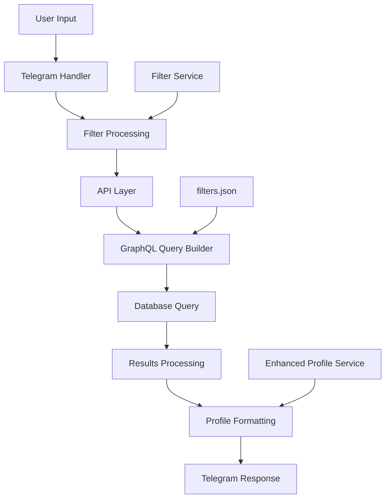

# GridDigger Filtering System - Complete Overview & Analysis

## Executive Summary

The GridDigger Telegram bot uses a multi-layered filtering system that allows users to search and filter profiles across multiple dimensions. The system combines GraphQL queries, JSON configuration, and a conversational UI to provide flexible search capabilities.

## System Architecture



## Filter Categories & Types

### 1. Profile Filters
**Location**: Main category for profile-specific attributes
- **Profile Name Search** (searchable)
  - Type: Text input
  - Query: `profileNameSearch`
  - GraphQL: `_or: {profileInfos: {name: {_contains: "value"}}, assets: {ticker: {_contains: "value"}}}`
  - Also searches asset tickers

- **Profile Type** (multiple choice)
  - Type: Dropdown selection
  - Query: `profileType`
  - GraphQL: `profileInfos: {profileType: {id: {_eq: value}}}`
  - Options fetched from: `profileTypes { name id }`

- **Profile Sector** (multiple choice)
  - Type: Dropdown selection
  - Query: `profileSector`
  - GraphQL: `profileInfos: {profileSector: {id: {_eq: value}}}`
  - Options fetched from: `profileSectors { name id }`

- **Profile Status** (multiple choice)
  - Type: Dropdown selection
  - Query: `profileStatuses`
  - GraphQL: `profileInfos: {profileStatus: {id: {_eq: value}}}`
  - Options fetched from: `profileStatuses { name id }`

### 2. Product Filters
**Location**: Filters based on products associated with profiles
- **Product Type** (multiple choice)
  - Type: Dropdown selection
  - Query: `productTypes`
  - GraphQL: `products: {productType: {id: {_eq: value}}}`
  - Options fetched from: `productTypes { name id }`

- **Product Status** (multiple choice)
  - Type: Dropdown selection
  - Query: `productStatuses`
  - GraphQL: `products: {productStatus: {id: {_eq: value}}}`
  - Options fetched from: `productStatus { name id }`

### 3. Asset Filters
**Location**: Filters based on assets/tokens associated with profiles
- **Asset Ticker** (searchable)
  - Type: Text input
  - Query: `assetTickers`
  - GraphQL: `assets: {ticker: {_ilike: "%value%"}}`
  - Case-insensitive partial matching

- **Asset Type** (multiple choice)
  - Type: Dropdown selection
  - Query: `assetTypes`
  - GraphQL: `assets: {assetType: {id: {_eq: value}}}`
  - Options fetched from: `assetType { name id }`

- **Asset Standard** (multiple choice)
  - Type: Dropdown selection
  - Query: `assetStandards`
  - GraphQL: `assets: {assetStandardSupport: {id: {_eq: value}}}`
  - Options fetched from: `assetStandardSupport { name id }`

### 4. Entity Filters
**Location**: Filters based on legal entities associated with profiles
- **Entity Type** (multiple choice)
  - Type: Dropdown selection
  - Query: `entityTypes`
  - GraphQL: `entities: {entityType: {id: {_eq: value}}}`
  - Options fetched from: `entityTypes { name id }`

- **Entity Name** (searchable)
  - Type: Text input
  - Query: `entityName`
  - GraphQL: `entities: {name: {_ilike: "%value%"}}`
  - Case-insensitive partial matching

## Search Modes

### Quick Search Mode (Default)
- **Target**: Profile names and asset tickers only
- **Speed**: Fast
- **Query**: Uses `profileNameSearch` filter
- **GraphQL**: `_or: {profileInfos: {name: {_contains: "value"}}, assets: {ticker: {_contains: "value"}}}`

### Deep Search Mode
- **Target**: Profile names, descriptions, and asset tickers
- **Speed**: Slower but more comprehensive
- **Query**: Uses `profileDeepSearch` filter
- **GraphQL**: Same as Quick Search (currently identical implementation)
- **Toggle**: Available via search mode button

## Data Flow & Processing

### 1. User Input Processing
```python
# handlers/filters.py
async def handle_filter_main_text(update, context):
    data["FILTERS"]["profileNameSearch"] = update.message.text
    data["FILTERS"]["profileNameSearch_query"] = update.message.text
```

### 2. Filter Application Logic
```python
# api.py
def apply_filters(filters):
    combined_clauses = {}
    for filter_name, value in filters:
        where_clause = filters_config["profile_filters"].get(filter_name)
        # Build GraphQL WHERE clause
```

### 3. Query Construction
- Filters are combined using GraphQL `_and` logic
- Multiple values for same field type use `_and` arrays
- Text searches use `_contains` or `_ilike` operators
- ID-based filters use `_eq` operator

### 4. Results Processing
```python
# handlers/utils.py
async def show_profiles(data, update, context):
    profiles = api.get_profiles(data)
    # Pagination with batch_size = 5
    # Enhanced profile formatting via service layer
```

## Configuration Files

### filters.json Structure
```json
{
  "filters_queries": {
    // Defines GraphQL queries for fetching filter options
  },
  "profile_filters": {
    // Maps filter names to GraphQL WHERE clauses
  },
  "sub_filters": {
    // Defines UI structure and filter metadata
  }
}
```

## User Interface Flow

### Main Filter Menu
1. **Show Profiles Button** (if results > 0)
2. **Reset Filters Button**
3. **Filter Category Buttons**:
   - 🟢/🟡 Profile Filters
   - 🟢/🟡 Product Filters
   - 🟢/🟡 Asset Filters
   - 🟢/🟡 Entity Filters
4. **Search Mode Toggle**

### Sub-Filter Menus
1. **Reset & Show Profiles Buttons**
2. **Individual Filter Options**
3. **Back Button**

### Filter States
- 🟢 **Green**: No filters applied in category
- 🟡 **Yellow**: Filters active in category

## Conversation States

```python
FILTER_MAIN = 1      # Main filter menu
FILTER_SUB = 2       # Sub-filter category menu
FILTER_CHOICES = 3   # Multiple choice selection
FILTER_FILLING = 4   # Text input for searchable filters
```

## API Integration

### V2 API Usage
- **Simple searches**: Use `search_profiles_v2()` for performance
- **Complex filters**: Fall back to legacy `apply_filters()`
- **Profile data**: Use V2 schema with `profileInfos` relationships

### GraphQL Query Patterns
```graphql
# Simple search
query SearchForProfileNameOrAssetTicker($searchTerm: String!) {
  roots(where: {_or: [
    {profileInfos: {name: {_contains: $searchTerm}}},
    {assets: {ticker: {_contains: $searchTerm}}}
  ]}) { id slug }
}

# Complex filtering
query filterProfiles {
  roots(where: {
    profileInfos: {profileType: {id: {_eq: 1}}},
    products: {productType: {id: {_eq: 2}}}
  }) { id slug }
}
```

## Pagination System

### Implementation
- **Batch Size**: 5 profiles per page
- **Storage**: All results stored in `user_data['pagination']`
- **Load More**: Button appears when more results available
- **State Management**: Tracks current offset and total results

### Data Structure
```python
data['pagination'] = {
    'current_offset': 0,
    'batch_size': 5,
    'total_results': len(profiles),
    'all_profiles': profiles
}
```

## Current Issues & Improvement Areas

### 1. **Performance Issues**
- **Problem**: Complex filters can be slow
- **Impact**: User experience degradation
- **Solution**: Implement query optimization and caching

### 2. **Search Mode Inconsistency**
- **Problem**: Deep Search and Quick Search use identical GraphQL
- **Impact**: No actual difference in search behavior
- **Solution**: Implement proper deep search with description matching

### 3. **Filter Validation**
- **Problem**: Limited input validation
- **Impact**: Potential for invalid queries
- **Solution**: Add comprehensive filter validation

### 4. **Cache Management**
- **Problem**: No intelligent cache invalidation
- **Impact**: Stale filter options
- **Solution**: Implement TTL-based cache with manual refresh

### 5. **Error Handling**
- **Problem**: Generic error messages
- **Impact**: Poor user experience on failures
- **Solution**: Add specific error handling and user feedback

### 6. **Filter Combinations**
- **Problem**: Complex filter logic can be confusing
- **Impact**: Users may not understand how filters combine
- **Solution**: Add filter preview and explanation

## Recommended Improvements

### Short Term (1-2 weeks)
1. **Fix Deep Search Implementation**
   - Add description field to deep search GraphQL
   - Implement proper differentiation between search modes

2. **Improve Error Messages**
   - Add user-friendly error messages
   - Implement fallback behavior for failed queries

3. **Add Filter Validation**
   - Validate text input length and content
   - Validate ID-based filter values

### Medium Term (1-2 months)
1. **Performance Optimization**
   - Implement query result caching
   - Add database query optimization
   - Implement progressive loading

2. **Enhanced UX**
   - Add filter combination preview
   - Implement filter history/favorites
   - Add advanced search operators

3. **Analytics Integration**
   - Track filter usage patterns
   - Implement A/B testing for filter UX
   - Add performance monitoring

### Long Term (3-6 months)
1. **AI-Powered Search**
   - Implement semantic search capabilities
   - Add natural language query processing
   - Implement search result ranking

2. **Advanced Filtering**
   - Add date range filters
   - Implement numerical range filters
   - Add geographic filtering

3. **Personalization**
   - Implement user preference learning
   - Add personalized filter suggestions
   - Implement saved search functionality

## Technical Debt

### Code Organization
- **Issue**: Filter logic scattered across multiple files
- **Impact**: Maintenance difficulty
- **Solution**: Consolidate into dedicated filter service

### Configuration Management
- **Issue**: Hard-coded filter definitions in JSON
- **Impact**: Inflexibility for dynamic filters
- **Solution**: Move to database-driven configuration

### Testing Coverage
- **Issue**: Limited test coverage for filter logic
- **Impact**: Risk of regressions
- **Solution**: Implement comprehensive filter testing

## Monitoring & Analytics

### Current Metrics
- Filter usage tracking via `generate_applied_filters_text()`
- User interaction monitoring via `MONITORING_GROUP_ID`
- Basic error logging

### Recommended Metrics
1. **Performance Metrics**
   - Query execution time
   - Cache hit/miss rates
   - User session duration

2. **Usage Metrics**
   - Most popular filter combinations
   - Search success rates
   - User conversion rates

3. **Error Metrics**
   - Filter failure rates
   - Query timeout rates
   - User abandonment points

---

**Document Version**: 1.0  
**Last Updated**: 2025-09-01  
**Author**: Grid Cortex Research Agent  
**Status**: Analysis Complete - Ready for Improvements