# Profile Carousel System - Product Requirements Document

## Executive Summary

**Problem**: The current profile display system floods the chat with multiple messages (6 messages per batch: 1 status + 5 individual profiles), creating a poor user experience and cluttered interface.

**Solution**: Implement a single-message carousel system that displays one profile at a time with smooth navigation controls, reducing message spam by 83% while improving usability.

**Impact**: Transform the profile browsing experience from a cluttered multi-message flood to a clean, navigable single-message interface.

---

## Problem Statement

### Current Issues
- **Message Flooding**: 6 messages per batch (1 status + 5 profiles) clogs the chat
- **Poor Mobile UX**: Multiple messages create scrolling chaos on mobile devices
- **Context Loss**: Users lose their place when scrolling through message history
- **Chat Pollution**: Profile searches dominate the conversation history
- **Scalability Issues**: With 1,967+ profiles, the current approach becomes unusable

### User Pain Points
1. **"The messages clog up the view"** - Direct user feedback
2. Difficulty comparing profiles due to scattered messages
3. Loss of filter context when scrolling
4. Poor experience on mobile devices
5. Inability to quickly navigate between profiles

---

## Solution Overview

### Profile Carousel System
A single-message interface that displays one profile at a time with intuitive navigation controls.

```mermaid
graph TD
    A[User clicks 'Show Profiles'] --> B[Single Message: Profile 1/5]
    B --> C{User Navigation}
    C -->|◀️ Previous| D[Edit message → Profile 2/5]
    C -->|▶️ Next| E[Edit message → Profile 3/5]
    C -->|📋 List View| F[Edit message → Profile Selection Menu]
    C -->|🔄 Load More| G[Load next batch → Profile 6/10]
    D --> C
    E --> C
    F --> H[Click profile name] --> B
    G --> C
```



### Key Benefits
- **83% Message Reduction**: 6 messages → 1 message
- **Clean Chat Interface**: Single message footprint
- **Smooth Navigation**: Previous/Next buttons for easy browsing
- **Context Preservation**: Users maintain their position and filters
- **Mobile Optimized**: Single message fits perfectly on mobile screens
- **Scalable**: Works efficiently with 5 or 1,000+ profiles

---

## Detailed Requirements

### 1. Core Carousel Functionality

#### 1.1 Single Message Display
- **Requirement**: Replace the current multi-message approach with a single message that gets edited
- **Implementation**: Use Telegram's `edit_message_text()` API
- **Fallback**: If editing fails, send new message and delete old one

#### 1.2 Profile Navigation
- **Previous Button**: `◀️ Previous` - Navigate to previous profile in current batch
- **Next Button**: `▶️ Next` - Navigate to next profile in current batch
- **Progress Indicator**: Display "Profile X of Y" status
- **Boundary Handling**: Disable buttons at first/last profile

#### 1.3 State Management
```python
user_data['carousel'] = {
    'current_index': 0,          # Current profile index (0-based)
    'batch_profiles': [...],     # Current batch of profiles
    'total_profiles': 1967,      # Total matching profiles
    'batch_start': 0,            # Starting index of current batch
    'batch_size': 5,             # Profiles per batch
    'message_id': 12345,         # Message ID for editing
    'chat_id': 67890            # Chat ID for editing
}
```

### 2. Enhanced Navigation Features

#### 2.1 Profile List View
- **List Button**: `📋 List View` - Show compact list of current batch
- **Quick Selection**: Clickable profile names for direct navigation
- **Return to Carousel**: Easy way to return to detailed view

#### 2.2 Batch Management
- **Load More**: `🔄 Load More (X remaining)` - Load next batch of profiles
- **Batch Indicators**: Show current batch position (e.g., "Batch 1-5 of 1,967")
- **Seamless Transitions**: Smooth loading between batches

#### 2.3 Keyboard Shortcuts (Power Users)
- **Number Keys**: Press 1-5 to jump to specific profile in current batch
- **Arrow Keys**: ← → for Previous/Next navigation
- **L Key**: Toggle List View
- **M Key**: Load More profiles

### 3. User Interface Design

#### 3.1 Carousel Message Layout
```
🔍 **Profile Search Results**

**Applied Filters:**
• Profile Type: DeFi Protocol
• Sector: Lending

**Profile 3 of 15** (Batch 1-5 of 1,967 total)

[PROFILE DETAILS HERE - Full enhanced profile card]

┌─────────────────────────────────────┐
│ ◀️ Previous │ 📋 List │ Next ▶️     │
│ 🔄 Load More (1,962 remaining)      │
└─────────────────────────────────────┘
```

#### 3.2 List View Layout
```
🔍 **Profile Search Results** - Quick Selection

**Batch 1-5 of 1,967 total profiles**

1️⃣ Aave Protocol - DeFi Lending Platform
2️⃣ Compound Finance - Algorithmic Money Market
3️⃣ MakerDAO - Decentralized Credit Platform
4️⃣ Uniswap Protocol - Automated Market Maker
5️⃣ Curve Finance - Exchange Liquidity Pool

┌─────────────────────────────────────┐
│ 🔄 Load More │ 🔙 Back to Carousel  │
└─────────────────────────────────────┘
```

### 4. Technical Implementation

#### 4.1 Core Functions
```python
async def show_profiles_carousel(data, update, context):
    """Main carousel display function"""
    
async def navigate_carousel(update, context, direction):
    """Handle Previous/Next navigation"""
    
async def show_profile_list(update, context):
    """Display compact profile list"""
    
async def select_profile_from_list(update, context, profile_index):
    """Jump to specific profile from list"""
    
async def load_more_profiles_carousel(update, context):
    """Load next batch of profiles"""
```

#### 4.2 Callback Handlers
- `carousel_previous` - Navigate to previous profile
- `carousel_next` - Navigate to next profile
- `carousel_list` - Show profile list view
- `carousel_select_{index}` - Select specific profile from list
- `carousel_load_more` - Load more profiles
- `carousel_back` - Return from list to carousel view

#### 4.3 Error Handling
- **Message Edit Failures**: Fallback to new message + delete old
- **Network Issues**: Retry mechanism with user feedback
- **State Corruption**: Reset carousel state and restart
- **Boundary Conditions**: Proper handling of first/last profiles

### 5. Performance Considerations

#### 5.1 Message Editing Optimization
- **Batch State Caching**: Cache profile data to avoid API calls
- **Smart Updates**: Only edit message when content actually changes
- **Rate Limiting**: Respect Telegram's API rate limits

#### 5.2 Memory Management
- **Profile Data Cleanup**: Clear old batch data when loading new batches
- **State Pruning**: Remove expired carousel states
- **Efficient Storage**: Store only essential profile data in carousel state

### 6. Migration Strategy

#### 6.1 Backward Compatibility
- **Feature Flag**: `ENABLE_CAROUSEL_MODE` environment variable
- **Gradual Rollout**: A/B test with percentage of users
- **Fallback Option**: Ability to revert to old system if needed

#### 6.2 User Education
- **First-Time Tutorial**: Show navigation hints on first carousel use
- **Help Command**: Update `/help` with carousel navigation instructions
- **Progressive Disclosure**: Introduce advanced features gradually

---

## Success Metrics

### Primary KPIs
- **Message Reduction**: Target 83% reduction (6 → 1 message per batch)
- **User Engagement**: Increased profile views per session
- **Navigation Efficiency**: Reduced time to find target profiles
- **Mobile Usage**: Improved mobile user retention

### Secondary Metrics
- **Error Rates**: Message editing failure rates < 1%
- **Performance**: Carousel navigation response time < 500ms
- **User Satisfaction**: Positive feedback on chat cleanliness
- **Feature Adoption**: Carousel usage vs. old pagination

---

## Implementation Phases

### Phase 1: Core Carousel (Week 1-2)
- [ ] Implement basic carousel navigation (Previous/Next)
- [ ] Add carousel state management
- [ ] Replace current `show_profiles()` function
- [ ] Add basic error handling and fallbacks

### Phase 2: Enhanced Navigation (Week 3)
- [ ] Implement profile list view
- [ ] Add quick selection functionality
- [ ] Implement batch loading in carousel
- [ ] Add progress indicators and status messages

### Phase 3: Advanced Features (Week 4)
- [ ] Add keyboard shortcuts for power users
- [ ] Implement smart caching and performance optimizations
- [ ] Add comprehensive error handling
- [ ] Create user tutorial and help documentation

### Phase 4: Polish & Launch (Week 5)
- [ ] Comprehensive testing across different scenarios
- [ ] Performance optimization and monitoring
- [ ] User feedback collection and iteration
- [ ] Full production rollout

---

## Technical Specifications

### Dependencies
- **Telegram Bot API**: `edit_message_text()`, `edit_message_reply_markup()`
- **Python Libraries**: `python-telegram-bot` v20+
- **State Management**: Enhanced `user_data` context storage
- **Error Handling**: Robust fallback mechanisms

### API Changes
```python
# New carousel-specific functions
async def show_profiles_carousel(data, update, context)
async def carousel_navigate_callback(update, context)
async def carousel_list_callback(update, context)
async def carousel_select_callback(update, context)
async def carousel_load_more_callback(update, context)

# Enhanced state management
def init_carousel_state(user_data, profiles)
def update_carousel_position(user_data, new_index)
def get_current_carousel_profile(user_data)
```

### Database Impact
- **No schema changes required**
- **Existing APIs remain unchanged**
- **State stored in memory (user_data context)**

---

## Risk Assessment

### High Risk
- **Message Editing Failures**: Telegram API limitations or network issues
  - *Mitigation*: Robust fallback to new message + delete old

### Medium Risk
- **User Adoption**: Users may need time to adapt to new interface
  - *Mitigation*: Progressive rollout with user education

### Low Risk
- **Performance Impact**: Slightly more complex state management
  - *Mitigation*: Efficient caching and cleanup strategies

---

## Conclusion

The Profile Carousel system addresses the critical UX issue of message flooding while providing a modern, intuitive interface for profile browsing. By reducing message spam by 83% and implementing smooth navigation controls, this solution will significantly improve user satisfaction and engagement with the GridDigger bot.

The phased implementation approach ensures minimal risk while delivering immediate value to users struggling with the current cluttered interface.